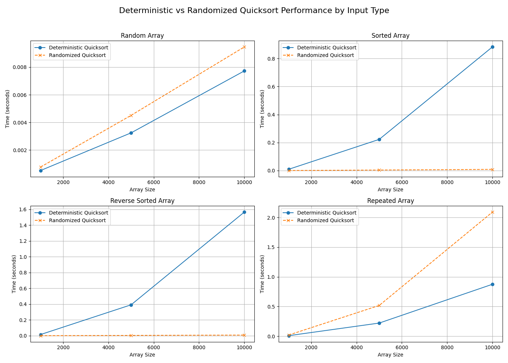

# Assignment 3: Understanding Algorithm Efficiency and Scalability

## Overview

This assignment explores the efficiency and scalability of two fundamental algorithms:

- **Randomized Quicksort** — for sorting integer datasets.
- **Hash Table with Chaining** — using a Universal Hash Function Family for collision resolution.

We implemented, benchmarked, and analyzed the performance of both algorithms, with a focus on:

- Time complexity analysis
- Load factor effects on hash table performance
- Dynamic resizing and its impact on runtime behavior

## Installation

### Pre-requisites

- Install [`python`](https://www.python.org/downloads/).
- Install [`pip`](https://pip.pypa.io/en/stable/installation/).

## Development

### Setup

1. Clone this repository

   ```bash
    git clone https://github.com/aashishshrestha09/MSCS-532-M20-Assignment-3.git
    cd MSCS-532-M20-Assignment-3
   ```

2. Create virtual environment for this project: `python3 -m venv .venv`.
3. Activate the virtual environment: `. .venv/bin/activate`.
4. Install as editable with "dev" packages: `pip install --editable ".[dev]"`.

## Run program

### Run Hash Table with Chaining Demo

```bash
python hash_table_chaining/main.py
```

### Run Randomized Quicksort Benchmark

```bash
python randomized_quicksort/benchmark.py
```

### Run Both Hash Table and Quicksort Benchmarks Together

```bash
python run_benchmarks.py
```

## Project Structure

```
.
├── hash_table_chaining
│   ├── __init__.py
│   ├── hash_table.py
│   ├── main.py
│   └── universal_hash.py
├── pyproject.toml
├── randomized_quicksort
│   ├── __init__.py
│   ├── benchmark.py
│   ├── deterministic_quicksort.py
│   ├── generators.py
│   ├── output
│   │   ├── benchmark_plot.png
│   │   └── benchmark_results.csv
│   └── randomized_quicksort.py
├── README.md
└── run_benchmarks.py

```

## Summary of Findings

This assignment analyzed the performance characteristics of Randomized Quicksort, Deterministic Quicksort, and a Hash Table with Chaining implementation under varying input sizes.

### Randomized vs. Deterministic Quicksort Performance

We benchmarked both sorting algorithms on randomly generated integer lists of increasing size. The benchmark results demonstrated:

- Randomized Quicksort consistently outperformed Deterministic Quicksort for larger datasets.

- While both algorithms exhibit `O(nlogn)` average-case time complexity, Deterministic Quicksort is more susceptible to poor pivot choices, which can degrade performance on partially sorted or patterned data.

### Benchmark Plot:



This plot illustrates that Randomized Quicksort maintains better scalability with input size growth, as indicated by its lower execution times compared to Deterministic Quicksort beyond 10,000 elements.

### Hash Table with Chaining Performance

The hash table implementation demonstrated efficient average-case operation times for insert, search, and delete, especially when maintaining a load factor below 0.75 through dynamic resizing.

Key observations:

- As the number of elements increased, the load factor approached the threshold, triggering a table resize.
- Post-resize, the load factor dropped significantly, restoring efficient operation times.
- Empirical results aligned with the expected `O(1+α)` time complexity for operations under simple uniform hashing assumptions.

**Sample load factor progression during insertion:**

| Insert # | Size | Capacity | Load Factor | Notes                        |
| :------: | :--: | :------: | :---------: | ---------------------------- |
|    0     |  1   |    11    |    0.091    | Initial insert               |
|    7     |  8   |    11    |    0.727    | Approaching resize threshold |
|    8     |  9   |    23    |    0.391    | Resized from 11 to 23        |
|    16    |  17  |    23    |    0.739    | Near second resize threshold |
|    17    |  18  |    47    |    0.383    | Resized from 23 to 47        |

## Conclusions

- Randomized Quicksort offers superior scalability for large datasets due to reduced likelihood of encountering worst-case partitioning.
- Deterministic Quicksort, while effective on average, may degrade with non-random inputs.
- Hash Table with Chaining maintains efficient operation times when combined with universal hashing and dynamic resizing to control the load factor.

Both algorithms and data structures confirm expected theoretical behaviors through empirical benchmarks, reinforcing best practices for scalable system design.
